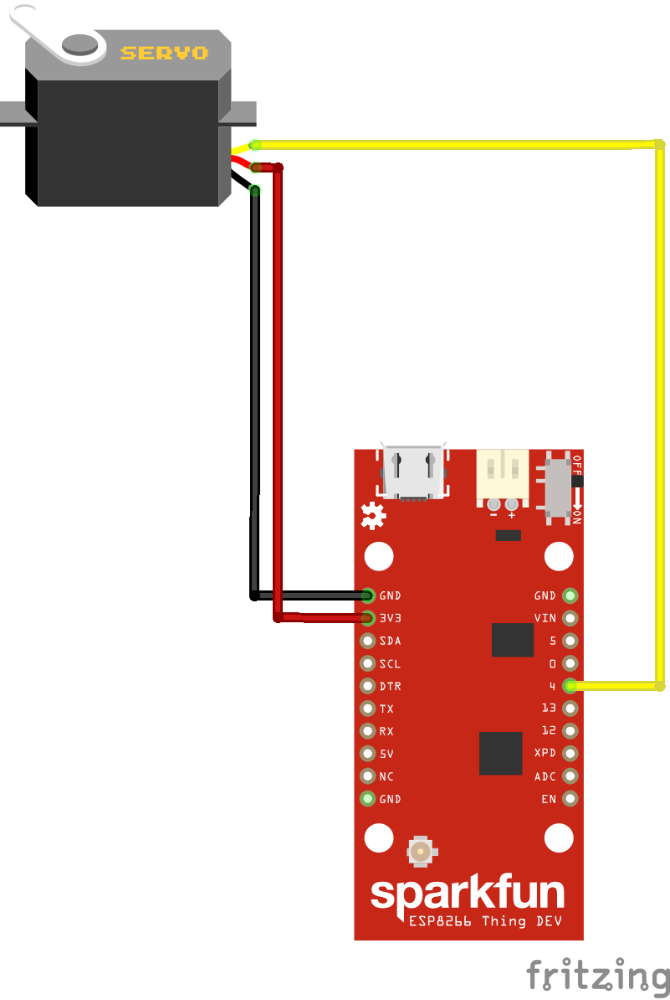

# ESP8266 MQTT Servo Control

Sketch for ESP8266 MCU that uses MQTT to pass commands to move a servo to the desired position.  [MQTT](https://mqtt.org) is a machine-to-machine Internet of Things communication protocol.  The purpose of this project was to prototype controlling window blinds with Apple HomeKit. A Raspberry PI 3 was used for the [Homebridge](https://homebridge.io), [homebridge-mqtt-blinds](https://github.com/knstntn1/homebridge-mqtt-blinds), and MQTT broker.

## Development platform
The development platform used for this project was a Sparkfun ESP8266 Thing.  However, any ESP8266 could be used.  The servo used was on old Futaba FP-S28.

## Project repository
This project was developed with and uses [PlatformIO](https://platformio.org) extension to [Atom](https://ide.atom.io), however, any Arduino IDE can be used.

## Wiring Diagram


## Configuration
WiFi and MQTT require specific configuration to connect to your WiFi router and MQTT broker.  This will require editing the sketch, rebuilding, and uploading to MCU(micro controller unit).

### WiFi
Update the following with your router SSID and password.
```
const char *ssid     = "<your router SSID";
const char *password = "<your router password";
```

### MQTT
Update the following with your MQTT broker IP address and port.  The default port is 1883.
```
IPAddress broker(###,###,###,###);
#define MQTT_BROKER_PORT (1883)
```

Change the ID and topics to desired settings for publishing to MQTT broker.
```
const char *ID             = "Office Blinds";
const char *SET_TOPIC      = "myBlind/SET/targetPosition";
const char *POSITION_TOPIC = "myBlind/GET/currentPosition";
const char *TARGET_TOPIC   = "myBlind/GET/targetPosition";
const char *STATE_TOPIC    = "myBlind/GET/positionState";
```

### Using and Testing using Mosquitto
Testing requires the [mosquitto](https://mosquitto.org) clients to be installed.  The values sent are between 0 and 100 and represent percentage.  The sketch will map the percentage to degrees/position.  The following is an example of publishing to a topic with the 'message' as the desired value.
```
mosquitto_pub -t "myBlind/SET/targetPosition" -m "0"
mosquitto_pub -t "myBlind/SET/targetPosition" -m "100"
```


## License
MIT License

Copyright (c) 2019 Charles Wade Hunley Jr

Permission is hereby granted, free of charge, to any person obtaining a copy
of this software and associated documentation files (the "Software"), to deal
in the Software without restriction, including without limitation the rights
to use, copy, modify, merge, publish, distribute, sublicense, and/or sell
copies of the Software, and to permit persons to whom the Software is
furnished to do so, subject to the following conditions:

The above copyright notice and this permission notice shall be included in all
copies or substantial portions of the Software.

THE SOFTWARE IS PROVIDED "AS IS", WITHOUT WARRANTY OF ANY KIND, EXPRESS OR
IMPLIED, INCLUDING BUT NOT LIMITED TO THE WARRANTIES OF MERCHANTABILITY,
FITNESS FOR A PARTICULAR PURPOSE AND NONINFRINGEMENT. IN NO EVENT SHALL THE
AUTHORS OR COPYRIGHT HOLDERS BE LIABLE FOR ANY CLAIM, DAMAGES OR OTHER
LIABILITY, WHETHER IN AN ACTION OF CONTRACT, TORT OR OTHERWISE, ARISING FROM,
OUT OF OR IN CONNECTION WITH THE SOFTWARE OR THE USE OR OTHER DEALINGS IN THE
SOFTWARE.
